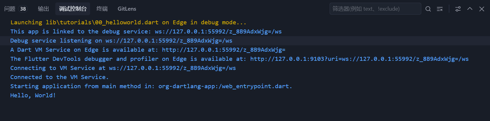
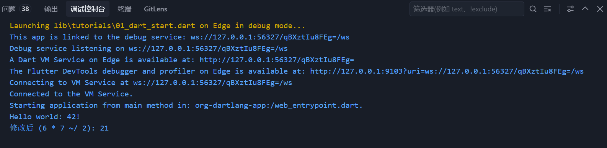
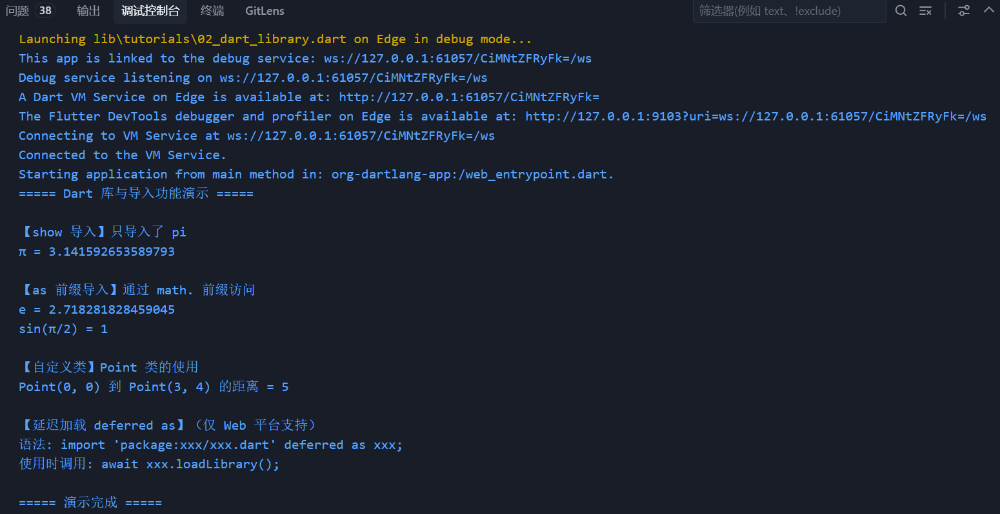
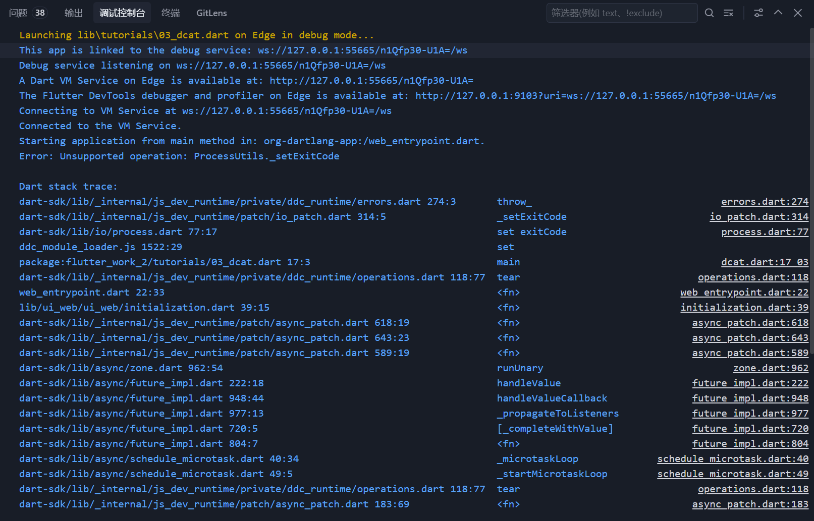
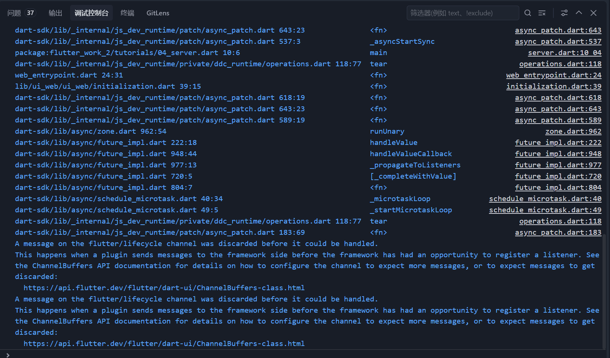

# Flutter Work 2 — Dart 命令行与服务器教程

基于 [Dart 官方教程](https://dart.ac.cn/tutorials/server) 的完整学习项目，涵盖 Dart 命令行应用从入门到 HTTP 服务器的全部基础。

## 环境

| 项目 | 说明 |
|------|------|
| Flutter | 3.41.4 |
| Dart | 3.11.1 |
| 平台 | Windows / macOS / Linux |

## 快速开始

```bash
git clone <仓库地址>
cd flutter_work_2
dart pub get
```

## 项目结构

```
flutter_work_2/
├── lib/
│   ├── main.dart                          # Flutter 入口
│   └── tutorials/                         # Dart 命令行 / 服务器教程
│       ├── 00_helloworld.dart             # Hello World
│       ├── 01_dart_start.dart             # 基础入门
│       ├── 02_dart_library.dart           # 库与导入
│       ├── 03_dcat.dart                   # dcat 命令行应用
│       └── 04_server.dart                 # HTTP 服务器
├── pubspec.yaml
└── README.md
```

---

## 00 — Hello World

> 来源：[Dart 入门 - 命令行与服务器应用](https://dart.ac.cn/tutorials/server/get-started)

最简单的 Dart 命令行程序，验证 Dart SDK 安装正确。

### 功能介绍

| 知识点 | 说明 |
|--------|------|
| `main()` | Dart 程序入口 |
| `print()` | 标准输出 |

### 演示效果

| 代码 | 运行效果 |
|------|----------|
|  |  |

### 核心代码

```dart
void main() {
  print('Hello, World!');
}
```

### 运行

```bash
dart run lib/tutorials/00_helloworld.dart
# Hello, World!
```

---

## 01 — Dart 基础入门

> 来源：[Dart 入门 - 命令行与服务器应用 / get-started](https://dart.ac.cn/tutorials/server/get-started)

演示 `dart create -t console` 模板项目结构、`calculate()` 函数、`dart run` 运行方式以及 `dart compile exe` AOT 编译。

### 功能介绍

| 知识点 | 说明 |
|--------|------|
| `dart create` | 控制台模板项目 |
| 函数定义 | `int calculate()` |
| `~/` 整除 | 算术运算符 |
| AOT 编译 | `dart compile exe` |

### 演示效果

| 代码 | 运行效果 |
|------|----------|
|  |  |

### 核心代码

```dart
/// 计算 6 * 7 的结果
int calculate() {
  return 6 * 7;
}

void main() {
  print('Hello world: ${calculate()}!');
}

/// 修改版：除以二（使用 ~/ 整除运算符）
int calculateModified() {
  return 6 * 7 ~/ 2;
}
```

### 运行

```bash
dart run lib/tutorials/01_dart_start.dart
# Hello world: 42!
# 修改后 (6 * 7 ~/ 2): 21
```

---

## 02 — 库与导入

> 来源：[Dart 语言 - 库与导入](https://dart.ac.cn/language/libraries)

演示 `import`、`as` 前缀、`show`/`hide` 选择性导入、`deferred as` 延迟加载以及 `library` 指令。

### 功能介绍

| 知识点 | 说明 |
|--------|------|
| `import` | 导入库 |
| `as` 前缀 | 解决命名冲突 |
| `show` / `hide` | 选择性导入 |
| `deferred as` | 延迟加载（Web） |
| `library` | 库级文档注释 |

### 演示效果

| 代码 | 运行效果 |
|------|----------|
|  |  |

### 核心代码

```dart
// show 导入：只导入 pi
import 'dart:math' show pi;

// as 前缀：避免命名冲突
import 'dart:math' as math;

// library 指令（可选）
/// 演示 Dart 库与导入功能的示例库
library;

// 自定义类
class Point {
  final double x, y;
  const Point(this.x, this.y);

  double distanceTo(Point other) {
    return math.sqrt(math.pow(other.x - x, 2) + math.pow(other.y - y, 2));
  }
}

void main() {
  print('π = $pi');
  print('e = ${math.e}');
  print('sin(π/2) = ${math.sin(math.pi / 2)}');

  const p1 = Point(0, 0);
  const p2 = Point(3, 4);
  print('$p1 到 $p2 的距离 = ${p1.distanceTo(p2)}');
}
```

### 运行

```bash
dart run lib/tutorials/02_dart_library.dart
```

---

## 03 — 命令行应用 dcat

> 来源：[Dart 教程 - 编写命令行应用](https://dart.ac.cn/tutorials/server/cmdline)

完整演示命令行参数解析（`args` 包）、stdin/stdout/stderr 读写、文件信息获取、文件读写、环境信息、退出码。

### 功能介绍

| 知识点 | 说明 |
|--------|------|
| `ArgParser` | 解析 `-n` 选项 |
| `stdin.pipe(stdout)` | 管道式读写 |
| `File.openRead()` | Stream 方式读取文件 |
| `utf8.decoder` + `LineSplitter` | 数据转换 |
| `FileSystemEntity.isDirectory()` | 文件信息 |
| `File.writeAsString()` / `openWrite()` | 写入文件 |
| `Platform.environment` | 环境信息 |
| `exitCode` | 设置退出码 |

### 演示效果

| 代码 | 运行效果 |
|------|----------|
|  |  |

### 核心代码

```dart
import 'dart:convert';
import 'dart:io';
import 'package:args/args.dart';

const lineNumber = 'line-number';

void main(List<String> arguments) {
  exitCode = 0;
  final parser = ArgParser()..addFlag(lineNumber, negatable: false, abbr: 'n');
  ArgResults argResults = parser.parse(arguments);
  dcat(argResults.rest, showLineNumbers: argResults[lineNumber] as bool);
}

Future<void> dcat(List<String> paths, {bool showLineNumbers = false}) async {
  if (paths.isEmpty) {
    await stdin.pipe(stdout);
  } else {
    for (final path in paths) {
      var lineNumber = 1;
      final lines = utf8.decoder
          .bind(File(path).openRead())
          .transform(const LineSplitter());
      try {
        await for (final line in lines) {
          if (showLineNumbers) stdout.write('${lineNumber++} ');
          stdout.writeln(line);
        }
      } catch (_) {
        await _handleError(path);
      }
    }
  }
}

Future<void> _handleError(String path) async {
  if (await FileSystemEntity.isDirectory(path)) {
    stderr.writeln('error: $path is a directory');
  } else {
    exitCode = 2;
  }
}
```

### 运行

```bash
# 显示文件内容（带行号）
dart run lib/tutorials/03_dcat.dart -- -n lib/tutorials/00_helloworld.dart

# 从管道读取
echo "hello from stdin" | dart run lib/tutorials/03_dcat.dart
```

---

## 04 — 简单 Dart HTTP 服务器

> 来源：[Dart 教程 - 编写 HTTP 服务器](https://dart.ac.cn/tutorials/server/httpserver)

使用 `dart:io` 的 `HttpServer` 搭建 HTTP 服务，演示路由分发、请求解析、响应构造。

### 功能介绍

| 知识点 | 说明 |
|--------|------|
| `HttpServer.bind()` | 绑定端口启动服务 |
| `await for` | 异步监听请求流 |
| `HttpRequest` | 解析请求方法/URI/头 |
| `HttpResponse` | 构造状态码/ContentType/响应体 |
| 路由分发 | 手动 path 匹配 |
| 404 处理 | 未匹配路由的默认响应 |

### 演示效果

| 代码 | 运行效果 |
|------|----------|
|  |  |

### 核心代码

```dart
import 'dart:io';

void main() async {
  final server = await HttpServer.bind(InternetAddress.loopbackIPv4, 8080);
  print('服务器已启动：http://localhost:${server.port}');

  await for (final request in server) {
    final path = request.uri.path;
    if (path == '/') {
      request.response
        ..write('Welcome!');
    } else if (path.startsWith('/hello/')) {
      final name = path.substring('/hello/'.length);
      request.response
        ..write('Hello, $name!');
    }
    request.response.close();
  }
}
```

### 运行

```bash
dart run lib/tutorials/04_server.dart
# 服务器已启动：http://localhost:8080
# 访问 GET http://localhost:8080/hello/Dart
```

---

## 依赖

```yaml
dependencies:
  args: ^2.7.0        # dcat 命令行参数解析
```
